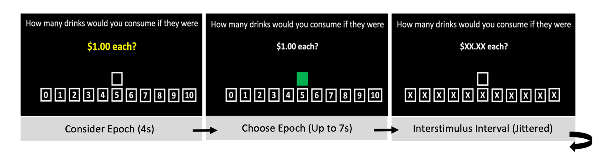

# NEURO ALC In-Scanner Alcohol Purchase Task

Materials for the **NEURO ALC** fMRI Alcohol Purchase Task (APT): E-Prime experiments, data-extraction workbooks, and ROI documentation.

The task is an in-scanner hypothetical alcohol demand paradigm from the R01 neuroeconomics AUD + stress project (MacKillop, Sweet). The two-epoch APT described in MacKillop et al. (2014).

---

## Task overview

On each trial the participant reports **how many drinks they would consume** at a stated price, using a 0–10 drink number line. The task is displayed in the MRI and the participant enters their response using a button box.



*Figure 1. In-scanner APT trial structure (from `NEURO ALC - In-Scanner Task Overview.docx`).*

Each trial has two active epochs, then an active-control ISI:

| Epoch | Screen | Duration | What happens |
| --- | --- | --- | --- |
| **Consider (Decide)** | `DECIDE` | 4 s, fixed | Participant views the price and drink options; no response yet |
| **Choose (Input)** | `CHOOSE` (neutral space turns green) | Up to ~6–7 s, ends at submit or timeout | Participant moves along the number line and confirms a drink count |
| **ISI** | Same layout with prices replaced by `X`s | Jittered (about 1–13 s in these scripts; mean ~5.8 s) | Remaining Choose time is absorbed into the ISI |

**Primary epoch of interest:** Choose (preference execution), both because it is the actual alcohol-choice output and because it previously showed more robust brain activity.

Prompt text:

> How many drinks would you consume if they were **[$X.XX each?]**

### Responses (right-hand button box)

| Button | Finger | Action |
| --- | --- | --- |
| First | Index | Move **left** (fewer drinks) |
| Second | Middle | Move **right** (more drinks) |
| Thumb | Thumb | **Submit** choice |

The scanner version waits for a scanner trigger (`Waiting for Trigger...`). In the lab, trigger can be simulated with **5**.

Reaction time is the length of the Choose epoch.

---

## Prices and demand-curve bins

There are **18 prices** from **$0 to $80 / drink**, grouped into three bins so that trials sample the inelastic, elastic, and suppressed portions of the demand curve:

| Bin | Demand-curve phase | Prices |
| --- | --- | --- |
| Low | Inelastic | $0.00, $0.01, $0.02, $0.03, $0.04, $0.05 |
| Medium | Elastic | $5, $7, $9, $11, $13, $15 |
| High | Suppressed | $30, $40, $50, $60, $70, $80 |

---

## Run structure

Scanner APT is **3 runs × 30 trials**. Each run is ~8.4 minutes of trials plus 6 s of instructions (~8.5 min total).

Runs 1 and 2 always use a **balanced** 10 / 10 / 10 split across low, medium, and high prices (same 18 prices, different orders and slight differences in which prices are repeated).

Run 3 is **adaptive**, chosen from Run 1 performance so that later trials oversample the part of the demand curve that was under-sampled:

| Run 3 version | Price mix (30 trials) | When to use |
| --- | --- | --- |
| **Normal** | 10 low / 10 medium / 10 high | Default / balanced Run 1 choices |
| **OverSample High** | 7 low / 7 medium / 16 high | Participant still “approaching” (buying) at many prices; need more suppressed-range trials |
| **OverSample Low** | 16 low / 8 medium / 6 high | Participant already “avoiding” (0 drinks) at many prices; need more inelastic-range trials |

The OverSample Low list omits $40 and $80 (16 unique prices instead of 18).

**How to pick Run 3:** after Run 1, paste the E-Prime output into `E-Prime Task Files/APT_AdatpiveRun3_Macro.xlsx` and open **Check This Tab!**. Each trial is coded:

- **Approach** — drink count at or near the maximum (10)
- **Ambivalent** — intermediate counts
- **Avoid** — 0 drinks

The sheet counts those categories and recommends Normal, Oversample High, or Oversample Low.

---

## Repository layout

```
NEUROALC_GitHub/
├── README.md
├── docs/apt_paradigm.png
├── NEURO ALC - In-Scanner Task Overview.docx
├── NEURO ALC - A Priori ROIs.docx
├── NEURO ALC - Empirical ROI Results (3dtcorr).docx
├── E-Prime Task Files/          ← organized scanner experiments + Run 3 picker
├── Data Extraction Macros/      ← one workbook per Run 3 type

```

### E-Prime task files

Use the organized copies in `E-Prime Task Files/` at the scanner:

| Folder | Experiment |
| --- | --- |
| `Run1/` | `R01_NE_APT Run 1` |
| `Run2/` | `R01_NE_APT Run 2` |
| `Run3/` | `R01_NE_APT Run 3_Normal`, `_OverSampleHigh`, `_OverSampleLow` |

File types:

| Extension | What it is |
| --- | --- |
| `.es2` | E-Prime 2 source (editable; currently at repo root) |
| `.ebs2` | E-Prime 2 compiled runtime |
| `.es3` / `.ebs3` | E-Prime 3 source / compiled |
| `.wndpos` | Window-position sidecar; not needed to run the task |


### Data extraction macros

Pick the workbook that matches the Run 3 version that was administered:

| Folder | Workbook |
| --- | --- |
| `Data Extraction Macros/Normal Run 3/` | `XXXX APT Processed NORMAL_LocalV1.xlsx` |
| `Data Extraction Macros/Oversample High Run 3/` | `XXXX APT Processed HIGH_LocalV1.xlsx` |
| `Data Extraction Macros/Oversample Low Run 3/` | `XXXX APT Processed LOW_LocalV1.xlsx` |

Typical workflow:

1. Paste raw E-Prime text into **Paste Run 1 / 2 / 3**.
2. Review cleaned trial tables on **Run 1 / 2 / 3**, demand plots on **Average Figure**, and combined indices on **Combined R1-R3**.
3. Check **ChoiceCoding** (Approach / Ambivalent / Avoid, plus a second “Rule 2” coding).
4. Export imaging timings from **AFNI STIM FILES** (afni_proc.py local-times format; empty conditions use `9999:9999`) and paste into participant files prior to running AFNI proc.py.
5. Copy summary metrics from **Behavioural Information**.

Indices produced by the macros include **intensity**, **Omax** (maximum expenditure), **breakpoint**, related consistency / reversal checks, and reaction time.

Workbooks may contain leftover example participant data. Treat them as templates.

### Protocol and ROI documents

| File | Contents | Purpose |
| --- | --- | --- |
| `NEURO ALC - In-Scanner Task Overview.docx` | Paradigm description and Figure 1 | Provide a schematic of the in-scanner APT task.
| `NEURO ALC - A Priori ROIs.docx` | Table 1: a priori ROIs (Talairach RAS cluster centers of mass; 3.5 mm isotropic voxels; slices in radiological convention, Z = −14 to +62, 4 mm spacing) | These ROIs were selected based on Amlung et al., 2024 and used in the primary NEURO ALC findings paper |
| `NEURO ALC - Empirical ROI Results (3dtcorr).docx` | Table 2: whole-brain 3dTcorr clusters linking demand metrics to Choose-epoch activity | These are the empirical ROI results from the primary NEURO ALC findings paper (see below) |

### 3dtcorr Method

AFNI's 3dTcorr was used to correlate behavioural demand metrics and brain activity during the related demand phase. Empirical 3dTcorr maps were thresholded at **p < .01** and **cluster size > 15**. Correlations are with **Choose-epoch** activity in the matching demand-curve phase:

- **Intensity × inelastic** choice activity
- **Elasticity × elastic** choice activity
- **Omax × elastic** choice activity

Coordinates are cluster centers of mass in Talairach RAS. Boldface in Table 2 marks ROIs with significant FDR-corrected between-group differences.

---

## Suggested scanner and analysis sequence

1. Scanner **Run 1**, then **Run 2**.
2. Paste Run 1 into `APT_AdatpiveRun3_Macro.xlsx` → **Check This Tab!** → select Normal / OverSample High / OverSample Low.
3. Scanner **Run 3** using that version.
4. Paste all three runs into the matching **Data Extraction Macros** workbook.
5. Export AFNI timing files and behavioural demand indices.
6. Run AFNI proc.py to process data.
7. Implement quality control.
8. Use AFNI's 3dROIStats to extract signal from a priori ROIs.
9. Exploratory: Use AFNI's 3dtcorr to correlate brain activity with behavioural indices.

---

## References

MacKillop, J., et al. (2014). In-scanner Alcohol Purchase Task paradigm as used in NEURO ALC (see task overview document for the study-specific description).
